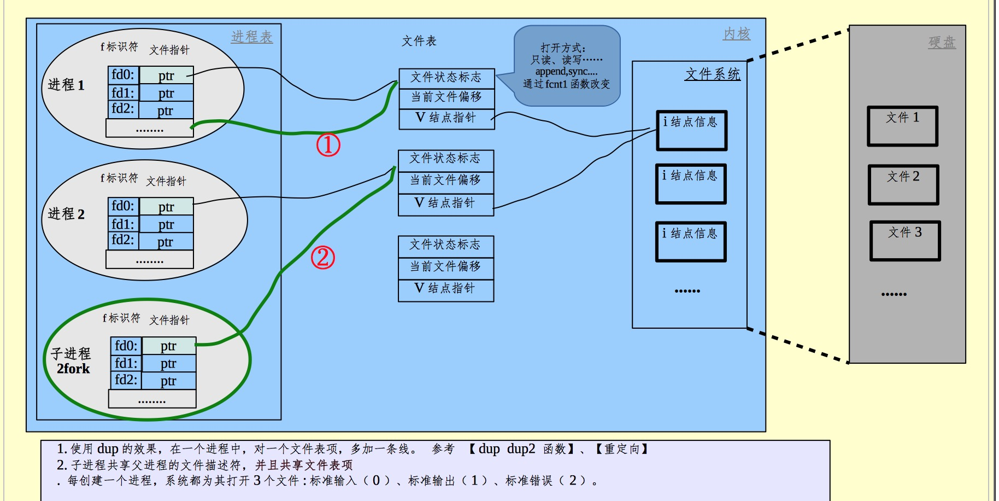

===============================================
基础
===============================================

进程
---------------------------------------

- 僵尸进程的目的，是子进程退出后，保留子进程的执行状态，以供父进程获取

- 任何长系统调用(会block的), 都有可能被信号中断， 像CHILD这样的信号。所以要检测EINTR(打断信号) 信号， 重启该系统调用

- 多进程 vs 多线程

  - 线程比进程更轻
  - 线程间同步、通信更容易
  - 进程更好隔绝问题，一个进程挂了不会影响其他进程， 而一个线程挂了，会导致这个进程内的所有线程都挂
  - 程间切换比进程间切换更轻；
  - 一个进程能打开的文件描述符是有上限的，如果有单进程多线程方式来写web server, 那么文件描述符资源就会是问题

- linux 系统load的含义

  对于单核机器来说，load=1.0 表示cpu的使用率已满(进程调度器中, ready的进程为0， running的进程刚好占满了运行队列), 这种情况下， 再多执行一个进程，这个新进程都要等待CPU有空再分片到自己. 对于多核机器，是累加关系。双核CPU的满负载状态,load=2.0, 四核满负载load=4.0

- 内核为每个进程维护着这个进程打开的文件表， 结构如下图

- 为什么操作系统要分用户态和内核态

  由于操作系统和用户共享了计算机系统的硬件和软件,必须保证用户程序中的一个出错仅影响正在运行的程序。采用共享,许多进程可能会受到一个程序中的一个漏洞 (bug) 的不利影响。例如,如果一个进程陷入死循环,那么这个死循环可能会阻止很多其他进程 的正确操作。在多道程序设计中可能会发生更为微妙的错误,如一个错误的程序可能修改另一个程序、另一程序的数据,甚至操作系统本身。 如果没有保护来处理这些错误,那么计算机只能一次执行一个进程,否则所有输出都 值得怀疑。操作系统的合理设计必须确保错误程序(或恶意程序)不会造成其他程序执行错误。(用户空间不允许访问某些东西，如: 进程表)
