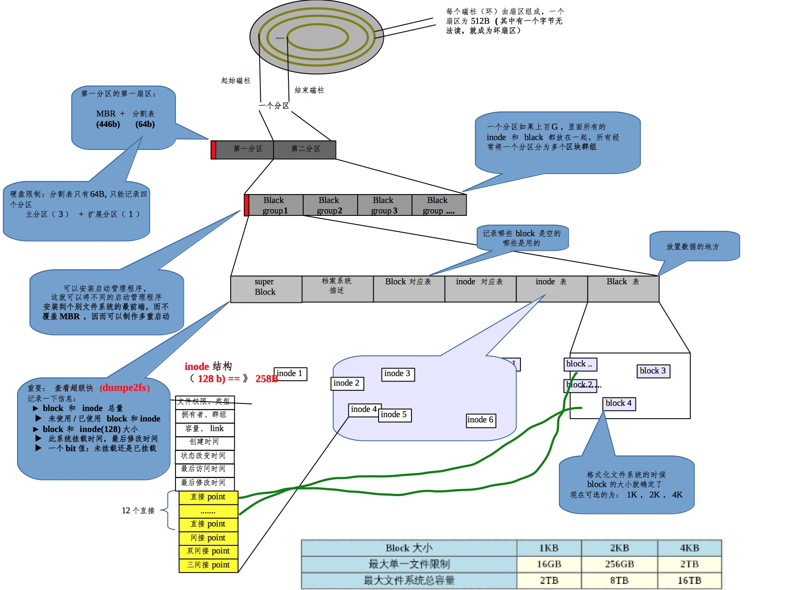

===============================================
文件系统
===============================================

linux ext文件系统结构
---------------------------------------

tip
---------------------------------------

- 查看操作系统支持的文件系统

.. code-block:: shell

  ls  -l  /lib/moudules/$(uname -r) /kernel/fs
