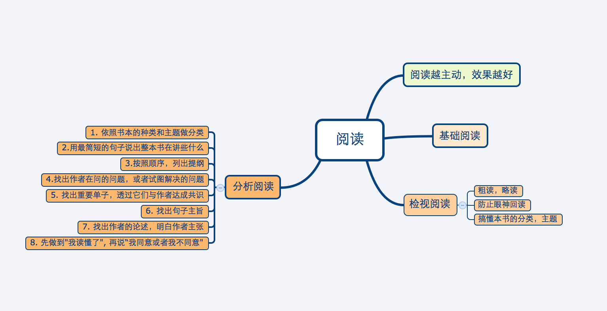

===============================================
读书笔记
===============================================

.. role:: red

互联网思维:

    * 以用户为中心， 像小米一样的用户反馈, 多思考消费者（行为、兴趣、分组）
    * “品牌”的打造很重要，并分一朝一夕。产品一旦发布，每一个行为，都影响用户心中的品牌
    * 好产品是关键

静心堂会议室。 有很多开站立会议，报着5分钟十分钟搞定的态度开会， 并把理解寄托给队友，  这种会开完其实没有人懂了。静心会议室，至少三十分钟的会才能进去，如果抱着五分钟搞定的态度进来，请滚出去。

黑客与画家
~~~~~~~~~~~~~~~~~~~~~~~

* 代码就像画画.画一幅好画,没有必要弄清楚每种颜料的原理,写好的代码,没有必要弄懂计算机的原理。

* 对大公司来说不是问题，因为生产特别优秀的产品不是它们的获胜手段。大公司只要做到不太烂，就能赢。

* 大不同才能小创新。

* 我们在Viaweb举办过一个比赛，看谁能说出我们软件中最差劲的地方。两位客服人员并列第一

* 向一个项目增加人手，往往会拖慢项目进程。随着参与人数的增加，人与人之间需要的沟通呈现指数式增长。人数越来越多，产生的bug也越多越多。

* 有钱的客户倾向于更贵的选择，即使便宜的选择更符合他们的需要，他们也不会买

* 首先，管理企业其实很简单，只要记住两点就可以了：做出用户喜欢的产品，保证开支小于收入。只要做到这两点，你就会超过大多数创业公司。

* ``创业就是压缩``

* 要致富，你需要两样东西：可测量性和可放大性。

* 乔布斯曾经说过，创业的成败取决于最早加入公司的那十个人。

* ``你努力30倍，最后得到的回报在现实中并不是30倍，而是0到1000倍之间的一个随机数。``

* ``大多数时候，促成买方掏钱的最好办法不是让买家看到有获利的可能，而是让他们感到失去机会的恐惧``

* 大多数时候，促成买方掏钱的最好办法不是让买家看到有获利的可能，而是让他们感到失去机会的恐惧#. 对速度的追求是人类内心深处根深蒂固的欲望。当你看着计算机这个小玩意，就会不由自主地希望程序运行得越快越好，真的要下一番功夫才能把这种欲望克制住。设计编程语言的时候，我们应该有意识地问自己，什么时候可以放弃一些性能，换来一点点便利性的提高。

google 时代工作方法
~~~~~~~~~~~~~~~~~~~~~~~

* 让信息尽可能快地离开大脑。 　　

* 多重任务通常会让你降低效率。　　

* 进行组织安排时，要绕开的是实际制约而不是假性制约。 　　

* 我每周都会安排时间阅读本周所有的会议笔记

一万小时天才理论
~~~~~~~~~~~~~~~~~~~~~~~

* 天才 = （10000 小时 X 精深联系） * 激情（兴趣）

* 精神练习要连续化， 练习打球，而不要一个动作、挥球、击球，一个动作一个动作去练习

魔鬼搭讪学
~~~~~~~~~~~~~~~~~~~~~~~

* 因为我知道即使追到了其实也留不住多久，我只是做一个男人在年轻时该做的事情，真正让我恐慌的不是眼前的美女而是流逝的时间。

* 其实，这跟我一贯强调的说真话原则也是一致的。扪心自问，我走过去搭讪，这跟她是哪里人、干什么工作、学什么专业根本就没有关系，我只是觉得她看着顺眼，我只关心此刻能跟她相处的时间，至于她的爱好和履历那都是以后的事情。

* 搭讪泡妞是一个做减法的过程，首先要认识了很多对象，然后再把其中对你不来电的拣出来筛掉，剩下的才是你美好生活的开始

害羞心理学
~~~~~~~~~~~~~~~~~~~~~~~

* ``把自己的害羞置于一个心理学手术台上， 以一个外科医生冷静而超然的态度面对它``

* 阅读好的报纸，电影，然后写影评

* 能够放得开的人，学东西越快

* ``害羞的孩子，总是害怕做错任何事情``

如何进行关键对话
~~~~~~~~~~~~~~~~~~~~~~~

* 当我们面对重要问题保持沉默时，我们的生活便开始上演悲剧了

* 在很多情况下，当上司或老板固执己见时，表现得高度自信时，人们往往倾向于抑制内心的真实想法，不敢冒犯具有权威的上级

* 为了吸引对方的注意力， 我们总是故作冷淡（这种思维方式简直是奇哉怪也!)

* ``如果总是通过转移目标或掩饰问题的方式来营造虚伪的安全感时， 这种策略只能逃避真正的问题，永远不会真正解决问题``

* 找到了共同目的， 你就有合理的理由和健康的气氛展开话题了

* 应当学会使用更准确的词汇来形容情绪和感受

哈佛凌晨四点半
~~~~~~~~~~~~~~~~~~~~~~~

* 尽力而为 与 竭尽全力 是存在差别的

* 那些能做成大事的人， 从来不会拒绝做小事

* 自信的人往往会看到好的一面， 并且会尽快找到解决问题的方法；不自信的人往往看到不好的一面，总是将细小的问题最大化

* 不要人云亦云

* 与其什么都不知道总以为自己是正确的，不如有些错误的想法

少有人走的路
~~~~~~~~~~~~~~~~~~~~~~~

* 父母的爱心至关重要， 即使家庭生活混乱， 倘若有爱存在， 照样可以培养出懂得自律的孩子

* 患有人格失调的父母， 为孩子树立的是反面的榜样。他们的病情，也会影响到婚姻、交友和事业。他们不肯担负自己的责任，
  导致人生问题重重

* 一旦新的资讯与过去的观念发生冲突，需要对地图大幅度修正，我们就会感到恐惧，宁可对新的资讯视而不见。我们的态度也变得
  相当奇特----不只是被动抗拒新的资讯，甚至指责新的资讯混淆是非，说它们是异端邪说。 ``我们话费大量时间和精力，去捍卫
  过去而陈腐的观念，却不去考虑如何更新旧的地图，这是多么可悲的事情啊!``

* 和原始人相比，现代人已经发生诸多的变化，这说明我们完全可以在一定程度上，违背与生俱来的本性，发展第二天性。
  人之为人，或许就在于我们可以超越本性

* 放弃人生的某些东西， 一定会给心灵带来痛苦。 ``不管是谁，经历人生的急转弯，都必须放弃某些快乐, 放弃属于自己的一部分.
  回避放弃只有一个办法，那就是永远停留在原地，不让双脚踏上旅途``

* 真正的爱是自由的选择。真正相爱的人，不一定非要生活在一起，充其量只是选择一起生活罢了.

* 真爱的本质，就是希望对方拥有独立自主的人格。

* 敢于追求独自主，本身就是自尊自爱的体现。我尊重自己，才不愿得过且过

* ``不要喜欢教育别人`` 真正爱别人，就会承认对方和自己是不同的、完全独立的个体。基于这样的认识，
  我们就不会轻易对他人说: "我是对的，你是错的"

* 传统的观念认为: 友谊意味着永不冲突，甚至意味着互相吹捧。 这样的友谊实际弱不经风， 它也不配称为友谊。
  ``友谊需以爱为出发点, 适当的职责和批评是必不可少的, 帮助对方达到心智成熟``

* 追求心智成熟， 不得不忍受痛苦，从童年的自我进入成年的自我，不得不摆脱孩子的身份，转而称为称职的父母.

如何阅读一本书
~~~~~~~~~~~~~~~~~~~~~~~

零成本创业
~~~~~~~~~~~~~~~~~~~~~~~

|

The writer give some suggestions for entrepreneur base on his experience. Instead of giving some actural suggestion, this
book tell us what mind or character a entprepreneur should be take. It tell us that we should use boss's mind to slove
problem instead of employee's.

* Entrepreneur find market first. Before thinking about funds, they must find out what to sell and how to sell. Funds
  is used to expand scale of business

* If you are willing to gathering a clique(呼朋引伴), feeling security behind people, then you are not suitable for
  entrepreneurship. Because entrepreneur must be take a risk by himself. This risk cannot transfer to another.

* ``Everything is matter of negotiation(谈判). The question is whether you have try.``

* Usually only two kind of entrepreneur will be successful. The one focus on Product and the one foucs on Customer.

* ``We have read a book named 《Customer is Second》. Inside there is a word make me shock. It said: "Who will buy it
  even if your employee do not willing to buy it.``

* ``"你不是不适应台北的生活，而是不适应一个人关在台北宿舍的生活。 那是坐牢，不是台北生活", 很多人有勇气去做某件事，却
  不见得有勇气改变自己的生活``

* ``The engineer I met usually relapsed into(陷入) computer. They contact to anthor rarely and most of them are
  uncommunicative. They cannot express their mind and don't have sense of organization. If they can overcome it, they
  will own high achievement(成就).``

* Relationship between entrepreneur and marking. If we are a dog food company. Our consumer is Woman, cosutomer is Dog,
  and buyer is Husband. Producting is making perfect production and Marking is find Woman who feed dog.

.. image:: ../_static/mind_note_zero_entreprenurship.png
   :alt: Warning!
   :width: 500
   :height: 400
   :align: center

