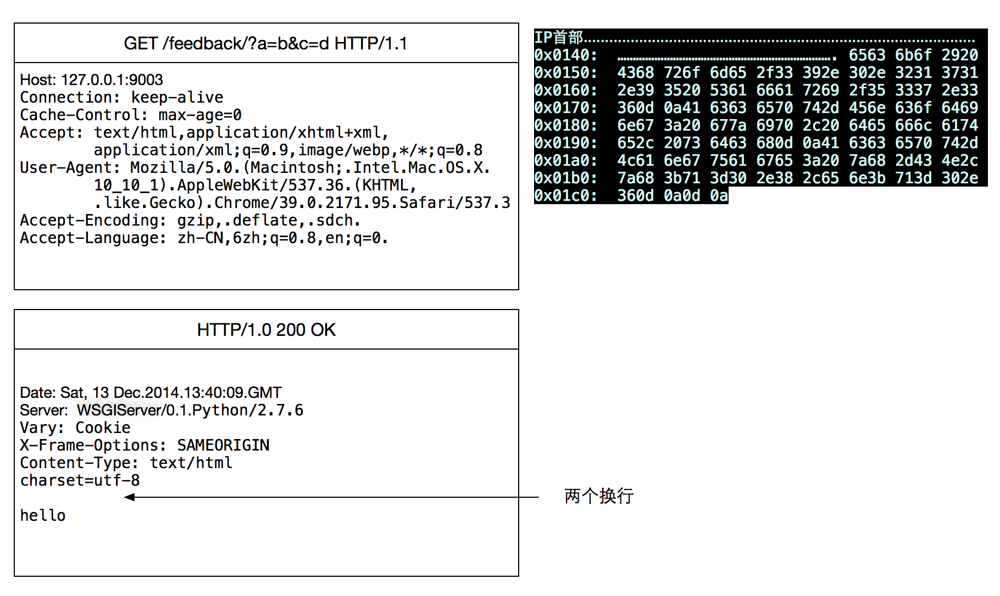
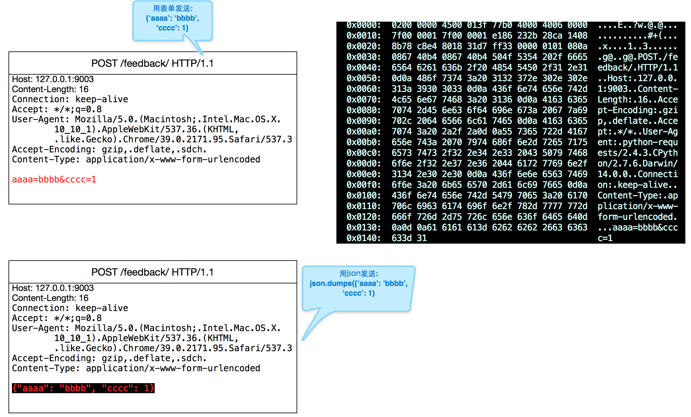

===============================================
http
===============================================

.. _http_protocol_head:

HEAD
---------------------------------------

client 发送HEAD请求到服务器， 服务器只返回头部信息回去，不发送真实数据. 这个方法的用途:

- 客户端查看某个资源的返回类型(mine-type)
- 查询某个静态文件是否存在
- 查询一个文件是否有修改(Cache-time)

GET
---------------------------------------

以下是用chrome 浏览器请求 django server的抓包结果

总结:

    1. GET请求的参数， 是放在请求行里的

    2. 请求中得换行是 ``0d0a``, 空格是 ``20``

    3. http请求是由服务端先close, 最后服务端维护2MSL

POST
---------------------------------------

POST发送数据时，分为 ``表单`` 和 ``JSON`` 两种，以下是两种的区别

表单 vs JSON
~~~~~~~~~~~~~~~~~~~~~~~

到底是使用 ``表单`` 还是 ``json`` 发送数据呢，其实区别不大。如果你要传输的数据有很强的格式，如::

    a = b
    c = [1,2,3]
    d = {a:b
         c:d}

那么最好用 ``json`` 方式来传输数据；如果你要传输的数据很简单，就用 ``表单`` 格式吧,
`相关连接 <http://stackoverflow.com/questions/11281117/x-www-form-urlencoded-vs-json-http-post>`_

上传文件
~~~~~~~~~~~~~~~~~~~~~~~

用post上传文件时， 文件数据是放在请求体内的，并不是放在首部。但是首部会指明文件数据从请求体哪个字节开始, 下面就是
一个客户端上传文件的请求:

.. image:: ../_static/network_http_post_upload.png
   :align: center

.. warning::
   上传文件的时候，必须用multipart格式(非www-form-data), 并且其他数据必须用表单，不能用JSON,参见:
   http://www.faqs.org/rfcs/rfc2388.html

其中， ``Content-Type: multipart/form-data; boundary=---------------------------7db15a14291cce`` 说明
了这个请求是“multipart/form-data”格式的，且“boundary”是 “---------------------------7db15a14291cce”这个字符串。

不难想象，“boundary”是用来隔开表单中不同部分数据的。例子中的表单就有 2 部分数据，
用“boundary”隔开。“boundary”一般由系统随机产生，但也可以简单的用“-------------”来代替。 紧接着 boundary
的是该部分数据的描述。

接下来才是数据。

FAQ
---------------------------------------

**python requests 库的timeout作用**::

    requests 发http请求的时候，timeout参数并不是整个请求的超时，而是目标服务器没有响应的时间。例如:

    requests.get('http://www.google.com', timeout=2)

    如果没有开vpn, 这个请求也不会2秒后报错， 因为大部分时间block 在DNS查询， 这步查询不受requests 的timeout影响。
