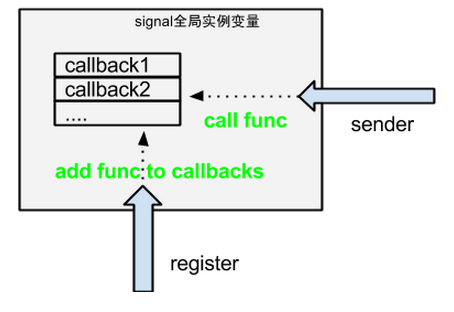

===============================================
django
===============================================

---------------------------------------
中间件
---------------------------------------

django 自带了一下中间件:

:ref:`django.contrib.sessions.middleware.SessionMiddleware <django_session>`

.. _django_session:

---------------------------------------
session
---------------------------------------

配置
~~~~~~~~~~~~~~~~~~~~~~~

使用django session 需要在middle中配置: ``django.contrib.sessions.middleware.SessionMiddleware``

这个中间件的作用是::

    在request之前，给request对象增加一个session属性，是sessionStore类型(这个类型可以在setting中用SESSION_ENGINE来配置)
    在response之后，查看response的status, 如果不等于500， 就把session对象存储下来(看SESSION_ENGINE来决定用什么存)

.. cssclass:: table-bordered
.. table::

    ================================    ==========================================================================
    配置                                作用
    ================================    ==========================================================================
    SESSION_COOKIE_NAME                 **sessionid** 默认的session字段名
    SESSION_CACHE_ALIAS                 **default** session 使用cache时，用哪个cache配置
    SESSION_COOKIE_AGE
    SESSION_COOKIE_DOMAIN               **None** http协议里session 的domain字段。 允许跨域session
    SESSION_COOKIE_HTTPONLY
    SESSION_COOKIE_PATH
    SESSION_COOKIE_SECURE
    SESSION_ENGINE                      **django.contrib.sessions.backends.db** django自带以下engine:
                                        django.contrib.sessions.backends.db:  用mysql实现的session
                                        django.contrib.sessions.backends.file: 用file
                                        django.contrib.sessions.backends.cache: 用mem, 不持久
                                        django.contrib.sessions.backends.cached_db: 用mem + mysql
    SESSION_EXPIRE_AT_BROWSER_CLOSE
    SESSION_FILE_PATH                   file session 使用保存session的路径
    SESSION_SAVE_EVERY_REQUEST          **False** 是否每个请求都store一遍session, 默认只有session改变的时候才store
    SESSION_SERIALIZER
    ================================    ==========================================================================

cache
~~~~~~~~~~~~~~~~~~~~~~~

默认django自带的session cached engine, 都是使用django.core.cache的功能来实现cache

清理
~~~~~~~~~~~~~~~~~~~~~~~

session 会每次生成一条记录， 用 ``clearsessions`` 可以清理过期的session. 可以把这条命令加在crontab里

---------------------------------------
测试
---------------------------------------

测试类

- django.utils.unittest.TestCase  基本测试类

- django.test.TransactionTestCase 事务测试类::

    每个test_函数执行过后，都会恢复数据库到初始状态。

- django.test.LiveServerTestCase 活服务测试类::

    每次测试的时候，会在后台模拟启动一个服务端(python manager.py runserver), 这就可以用 Selenium 来自动化测试

---------------------------------------
优化
---------------------------------------

* 如果不使用django的session, 那么在settings里把session的中间件注掉，减少开销

---------------------------------------
其他
---------------------------------------

信号
~~~~~~~~~~~~~~~~~~~~~~~

django 的信号，其实就是定义一个全局类， 这个类的作用就是观察者， 可以注册
一堆callback, 最后通过send()方法来调用每个signal 上的callback. **它的作用就是解藕, 无其他作用**

第一步, **注册 signal**,  这步建议把代码写在每个app下的signal.py 文件中::

    import django.dispatch
    delete_done = django.dispatch.Signal(providing_args=['obj'])

第二步, **关联对应的listener**, 建议把这行代码写在 models.py 中::

    class Article:
        pass

    def callback(sender, **kwargs):
        pass

    signals.delete_done.connect(callback, sender=Article)

第三步, **触发信号**::

    signals.delete_done.send(sender=Article, obj=self)

.. code-block:: console

    $ pip install -U mongoengine
