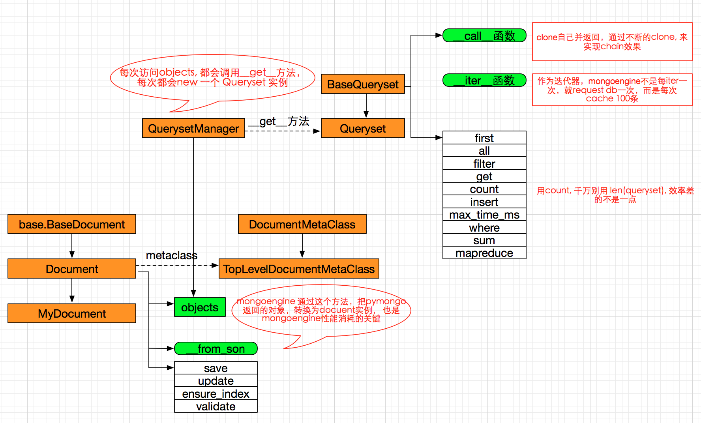

mongoengine
===============================================

mongoengine 是纯python框架，实现了mongo的ORM, 整体结构如下

为什么要使用 metaclass::

    自定义文档(MyDocument) 继承自Document,  Document 很多函数都需要知道当前文档有哪些field,
    所以需要metaclass, 在创建MyDocument类的时候， 把所有自定义field 存放在 cls._fields 中，
    父类Document 中的方法访问cls._fields 就可以知道自定义了哪些field

问题
~~~~~~~~~~~~~~~~~~~~~~~

mongoengine 可以理解为对pymongo的封装，跟pymongo比，它最大的消耗在 ``从pymongo查询的结果，转换为Document实例``,
这确实很费资源

mongoengine 在文档实例save的时候，会调用validate来验证每一个field,  这步没有必要，比较耗时

在使用queryset类时，同时用 as_pymongo() 和 only() 函数，对dict类的解析有问题， ``不能解析到dict内部(二级hash)``,
这是mongoengine 的问题 https://github.com/MongoEngine/mongoengine/issues/563, 还未修复
