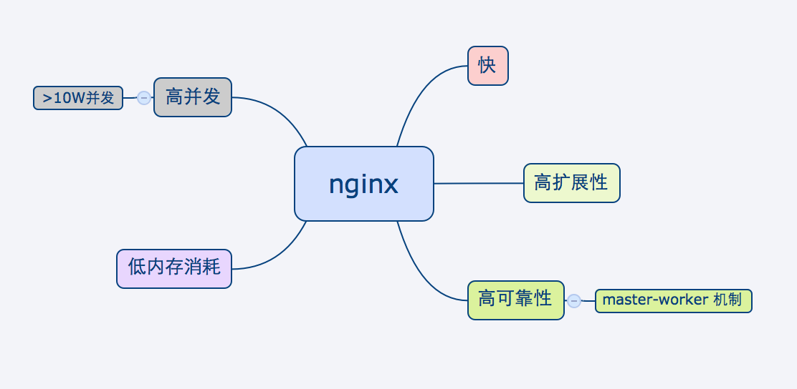

===============================================
nginx
===============================================

---------------------------------------
简介
---------------------------------------

nginx 是开源、多平台的http 服务器，以下是它的特性:

|

|

nginx 虽然是开源的，但Igor Sysoev 已为nginx 成立公司，提供商业级的产品与支持

---------------------------------------
安装
---------------------------------------

依赖
~~~~~~~~~~~~~~~~~~~~~~~

.. cssclass:: table-bordered
.. table::

    ===============         =============================            =============
    依赖库                  作用                                     备注
    ===============         =============================            =============
    PCRE(required)          正则匹配                                 无
    zlib(required)          gzip 压缩使用
    openssl                 https 需要
    ===============         =============================            =============

编译
~~~~~~~~~~~~~~~~~~~~~~~

|

configure选项

.. cssclass:: table-bordered
.. table::

    =======================================             =============================================================================
    选项(默认安装)                                      作用
    =======================================             =============================================================================
    --with-rtsig-module (no)                            使用rtsig module 处理事件驱动. 默认情况下， nginx 不安装rtsig module
    --with-select_module (no)                           使用select module 处理事件驱动. 如果nginx 没有找到epoll, 该模块将会被安装
    --without-select_module (no)                        不使用select module 处理事件驱动
    --with-poll_module (no)                             与select 模块类似，默认不会安装
    --without-poll_module (no)                          不使用poll module 处理事件驱动
    --with-aio_module (no)                              使用AIO方式处理事件驱动， 这里的 aio module 只能与FreeBSD系统上的kqueue模块
                                                        合作， Linux上无法使用
    --without-http_charset_module (yes)                 这个模块可以降服务器发出的http响应重新编码
    --without-http_gzip_module (yes)
    --without-http-ssi_module (yes)                     该模块可以在Response 中加入特定的内容，如html固定页头/页尾
    --without-http_userid_module (yes)                  这个模块可以通过HTTP请求头，认证用户信息，以确定请求是否合法
    --without-http_access_module (yes)                  这个模块可以限制客户端IP
    --without-http_auth_basic_module                    这个模块可以提供最简单的用户密码验证
    --without-http_autoindex_module                     目录浏览功能
    --without-http_geo_module                           这个模块可以定义一些变量，这些变量的值与客户端IP地址关联. 例如: 这样Nginx
                                                        针对不同地域显示不同的语言
    --without-http_map_module                           这个模块可以建立一个key/value映射表, 这样可以针对不同的url做特殊处理
    =======================================             =============================================================================

|

configure 脚本的主要目的是 ``检测编译依赖库是否存在`` , ``生成ngx_modules.c文件``

|

信号操作
~~~~~~~~~~~~~~~~~~~~~~~

.. cssclass:: table-bordered
.. table::

    ===================             =====================================================
    信号                            作用
    ===================             =====================================================
    nginx -s stop                   停止服务
    nginx -s quit                   优雅的停止服务
    nginx -s reload                 重载配置
    nginx -s reopen                 日志文件回滚
    kill -s SIGUSR2                 平滑升级nginx
    ===================             =====================================================

---------------------------------------
配置
---------------------------------------

基本配置
~~~~~~~~~~~~~~~~~~~~~~~

.. cssclass:: table-bordered
.. table::

    ================================    ==============================================================================
    选项                                作用
    ================================    ==============================================================================
    user <用户名>                       worker进程的执行用户
    use <事件模型>                      选择事件模型(如: epoll)
    listen <num...>                     监听端口, 它有以下参数:

                                        **default_server**: 默认server, nginx 可能有多个server配置，设置这个后当前
                                        server就成为默认server(server_name没有匹配)

                                        **backlog <num>**: 略

                                        **deferred**: 默认新来一个TCP连接，三次握手后master进程就唤醒worker进程来
                                        接待。 设置这个参数后，三次握手完成master并不立 刻唤醒worker, 而是这个连接
                                        上真来了数据，才唤醒worker, 它减轻了worker的负担。
                                        ``需要根据业务特征来决定``
    server_name <...>                   虚拟主机配置, nginx 检测request头的HOST字段，拿来匹配server, 按以下顺序匹配:

                                        1. 字符串完全匹配, 如: www.test.com

                                        2. 通配符前匹配, 如: \*.test.com

                                        3. 通配符后匹配, 如: www.test.\*

                                        4. 正则匹配, 如: ^test.com

                                        5. 都没有匹配， 使用default_server

    server_names_hash_bucket_size       为了提高快速找到server_name的能力， nginx使用了散列桶， 这个参数指定散列桶的
                                        大小， 越大越占内存，但速度越快. 默认32|64|128
    server_names_hash_max_size          效果同上. 默认512
    server_name_in_redirect <yes>       重定向的时候，把原请求里的HOST, 换成server_name写的第一个主机名
    location <...>                      用请求中的url来匹配, 见 :ref:`location <nginx_location>`
    alias <path>                        指定文件路径
    root <path>                         指定文件路径(和alias 互为两种方式)
    index <path>                        指定主页的html文件, 默认为(index.html)
    error_page <code> <url>             错误重定向, 出现<code>对应的错误response时，nginx 把结果重定向到url
    resursive_error_pages <on>          是否打开"错误重定向"的递归
    try_files <path1> <path2> <url>     按顺序尝试每一个path
    limit_except {...}                  按http方法, 限制客户端请求种类, 见 :ref:`limit_except <nginx_limit_except>`
    client_max_body_size <size>         根据请求头的content-Length, 来限制请求.
    limit_rate <num>                    对每一个TCP连接限速
    ignore_invalid_headers <on>         如果出现不合法的HTTP头部时， nginx 会忽略错误继续处理。但如果这个选项被off
                                        nginx 会直接返回400
    underscores_in_headers <on>         http头部是否允许带下划线
    log_not_found <on>                  404是否记录日志
    merge_slashes <on>                  是否合并url中相邻的/, 如: //test//a.txt 会变成 /test/a.txt
    resolver <ip>                       设置DNS服务器地址
    resolver_timeout <time>             DNS解析超时时间, 默认30s
    server_tokens <on>                  返回错误页面时，是否在server中注明nginx版本, 默认on
    ================================    ==============================================================================

|

内部资源分配
~~~~~~~~~~~~~~~~~~~~~~~

.. cssclass:: table-bordered
.. table::

    ================================    ==========================================================================
    选项                                作用
    ================================    ==========================================================================
    client_header_buffer_size <num>     nginx 接收客户端request 的headers时，开辟的内存大小, 默认 1k
    large_client_header_buffers         nginx 接收超大request 头部时，使用的buffer 个数 和每个buffer大小, 如果请求
                                        头部大于这个值，那么nginx会报"Request too large url"
    client_body_buffer_size <num>       一个请求的请求体需要存在内存中， 这个值指定了buffer大小, 如果超过这个值，
                                        nginx 会把请求体写入磁盘
    connnection_pool_size <num>         每个TCP连接分配的内存池初始大小, 默认256, 如果这个值太大，内存占用会很多，
                                        如果很小，造成分配次数增多
    request_pool_size <num>             一个请求开辟内存池的初始大小, 默认4k
    client_header_timeout <time>        一个连接建立后， nginx 接收HTTP头部的超时时间，如果在这个时间内没有读到
                                        客户端发来的字节， 则认为超时，返回408(Request time out) 默认60
    client_body_timeout <time>          同上，请求体超时
    send_timeout <time>                 nginx 向客户端发送了数据，但客户端超过这么长时间都没有去接收数据，那么
                                        nginx 会关闭这个连接
    reset_timeout_connection            ??? 向客户端发送RST来关闭连接， 减少服务端的FIN-WAIT状态套接字
    lingering_close                     ???
    lingering_time                      ???
    lingering_timeout                   ???
    keepalive_disable <...>             对某些浏览器禁用 keepalive 功能
    keepalive_timeout <time>            keepalive 超时时间
    keepalive_requests <num>            一个keepalive 连接上默认最多能发送的request 个数
    tcp_nodelay <on>                    对keepalive连接是否使用TCP_NODELAY选项
    tcp_nopush <on>                     是否开启FreeDSB的TCP_NOPUSH 或Linux 的TCP_CORK功能
    ================================    ==========================================================================

|

文件访问
~~~~~~~~~~~~~~~~~~~~~~~

.. cssclass:: table-bordered
.. table::

    ================================    ==========================================================================
    选项                                作用
    ================================    ==========================================================================
    aio                                 ???
    open_file_cache                     ???
    open_file_cache_errors              ???
    open_file_cache_min_uses            ???
    open_file_cache_valid               ???
    ================================    ==========================================================================

|

MIME
~~~~~~~~~~~~~~~~~~~~~~~

.. cssclass:: table-bordered
.. table::

    ================================    ==========================================================================
    选项                                作用
    ================================    ==========================================================================
    type {...}                          配置文件扩展名与mime映射
    default_type <...>                  默认MIME类型
    types_hash_bucket_size              上面映射的散列桶大小
    types_hash_max_size                 上面散列桶的个数
    ================================    ==========================================================================

|

性能调优
~~~~~~~~~~~~~~~~~~~~~~~

.. cssclass:: table-bordered
.. table::

    ============================    ==========================================================================
    选项                            作用
    ============================    ==========================================================================
    worker_rlimit_nofile <int>      设置一个worker进程可以打开的最大文件句柄数
    worker_cpu_affinity <...>       worker和CPU绑定 (仅对Linux系统起作用， 内部调用sched_setaffinity()来实现,
                                    示例: worker_cpu_affinity 1000 0100 0010 0001
    ssl_engine <device>             ssl硬件加速。如果服务器上有SSL硬件加速设备，就可以用这个指令配置
    timer_resolution <time>         默认情况下，每次内核事件调用，都要执行一次 gettimeofday
    worker_prority <int>            在Linux系统中，每个进程都有优先级，范围为[-19,+20], -19优先级最高,
                                    如果想让分配CPU资源的时候，多分给nginx, 可以增加nginx优先级，默认nginx 值
                                    为0 (不建议低于-5, 内核进程的优先级)
    accept_mutex <on>               1. ``避免惊群效果`` (每个 accept 上一把锁);
                                    2. ``负载平衡`` (如果当前worker的请求量已达到worker_connections的7/8，
                                       则这个worker 不参与竞争新来的request)
    multi_accept <on>               当事件模型通知有新请求时，尽可能对本次调度中客户端的所有TCP请求都建立连接
    worker_connections              每个worker 的连接池大小。 所以:
                                    ``nginx能接收的总的连接数 = worker_connections * worker_processes``
                                    来更新nginx中的缓存时钟, 这个选项控制执行间隔
    sendfile on                     启用sendfile 系统调用，来减少static file 请求时，用户态和内核态的切换时间
    keepalive_timeout               unknown
    ============================    ==========================================================================

---------------------------------------
反向代理
---------------------------------------

.. image:: ../_static/s_nginx_rproxy.png

Nginx代理和squid代理机制不太一样， 客户端发送请求， nginx代理服务器接收完整个请求，才向upstream转发请求， 这样做的目的
主要是 ``降低upstream`` 的压力. 因为客户端到nginx代理之间一般式走外网， 速度较慢。 而代理和upstream之间一般式走内网，
速度很快

负载均衡
~~~~~~~~~~~~~~~~~~~~~~~

upstream负载均衡有两种机制: ``ip_hash`` 和 ``weight``

ip_hash 是nginx按客户端ip, 自动的把请求打在上游集群中特定一台, 配置如下::

    upstream backend {
        ip_hash
        server backend1.example.com;
        server backend2.example.com;
        server backend3.example.com;
    }

weight 是按权重来分流量， 配置如下::

    upstream backend {
        server backend1.example.com weight=2 max_fails=3 fail_timeout=30s;
        server backend2.example.com weight=2 max_fails=2 fail_timeout=20s;
        server backend3.example.com weight=1;
    }

一份反向代理配置如下::

    upstream real.sites {

        server 123.123.123.123;

        // 用keepalive保存长连接，降低频繁创建连接的开销
        keepalive 16;
    }

    proxy_cache_path /path/to/cache levels=1:2 keys_zone=static_cache:100m;

    server {
        server_name     www.example.com;

        // 把真正的IP地址放到header的X-Forwarded-For里面
        proxy_set_header X-Forwarded-For $proxy_add_x_forwarded_for;

        proxy_http_version 1.1;

        proxy_set_header Connection "";

        # 当某一个上游返回503错误时， nginx 继续换一个上游转发
        # 默认一个上游返回错误时，nginx是不会换一个上游转发的
        proxy_next_upstream http_503;

        // 把静态资源缓存起来，减少服务器间数据传输
        location ~ \.(css|js|jpg|png|gif|ico)$ {

        proxy_cache static_cache;

        proxy_pass http://real.sites;
        }

        location / {
            proxy_pass http://real.sites;
        }
    }

---------------------------------------
性能调优
---------------------------------------

内核参数调优
~~~~~~~~~~~~~~~~~~~~~~~
见 :ref:`内核调优<http_core_tuning>`

debug nginx
~~~~~~~~~~~~~~~~~~~~~~~

方法1: 打开 --with-debug

方法2: Debugging nginx with DTrace pid provider

相关链接: http://nginx.org/en/docs/nginx_dtrace_pid_provider.html

负载均衡
~~~~~~~~~~~~~~~~~~~~~~~

nginx 使用upstream 分流

deferred
~~~~~~~~~~~~~~~~~~~~~~~

listen 80 deferred;

---------------------------------------
其他
---------------------------------------

.. _nginx_location:

location 配置
~~~~~~~~~~~~~~~~~~~~~~~

``=`` 匹配符， 完全匹配才处理， e.g::

   location = / {
        # 完全匹配才处理
        ...
   }

``~`` 匹配符， 表示大小写敏感

``~*`` 匹配符， 表示大小写不敏感

可以使用正则, e.g::

   location ~* \.(gif|png)$ {
        # 以gif 或者 png 结尾的url
   }

.. _nginx_limit_except:

限制请求方法
~~~~~~~~~~~~~~~~~~~~~~~

配置::

    limit_except GET POST DELETE {
        deny all;
    }

意思是， 除了GET POST DELETE 方法外，其他一切请求都deny

---------------------------------------
问题
---------------------------------------

nginx 配置 keepalive_time = 0 后， server端处理完请求会有大量TIME-WAIT。但是只要把这个值设为不为0， 就不会有TIME-WAIT了

