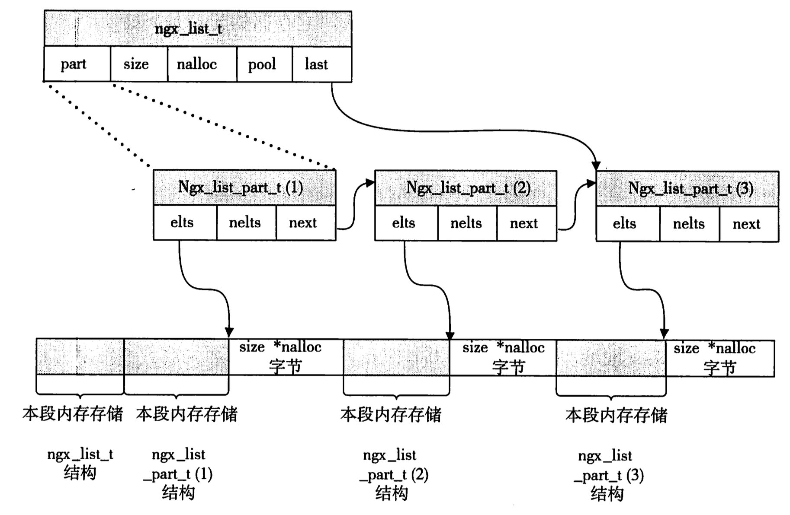

===============================================
struct
===============================================

---------------------------------------
ngx_str_t
---------------------------------------

struct define::

    typedef struct {
        size_t      len;
        u_char     *data;
    } ngx_str_t;

nginx string is not like normal C-str. Which is not end with '\\0'. It's controlled by len. So it can share memory
sources bewteen sereval string objects.

---------------------------------------
ngx_list_t
---------------------------------------

struct define::

    typedef struct ngx_list_part_s  ngx_list_part_t;

    struct ngx_list_part_s {
        void             *elts;
        ngx_uint_t        nelts;
        ngx_list_part_t  *next;
    };

    typedef struct {
        ngx_list_part_t  *last;
        ngx_list_part_t   part;
        size_t            size;
        ngx_uint_t        nalloc;
        ngx_pool_t       *pool;     // memory pool object
    } ngx_list_t;

The node of nginx list is array. It's high performance for index item in it. The memory calloc picture like

---------------------------------------
ngx_table_elt_t
---------------------------------------

struct defined::

    typedef struct {
        ngx_uint_t        hash;
        ngx_str_t         key;
        ngx_str_t         value;
        u_char           *lowcase_key;
    } ngx_table_elt_t;

This struct is designed for http headers. Because header key is not case sensitive.

---------------------------------------
ngx_module_t
---------------------------------------

struct defined::

    struct ngx_module_s {

        // this value represent the order of this moudle in one type of modules.
        // the value is important because it affect how proccess one request with much modules

        ngx_uint_t            ctx_index;

        // like up, but it's all modules

        ngx_uint_t            index;

        // remind and unused
        ngx_uint_t            spare0;
        ngx_uint_t            spare1;
        ngx_uint_t            spare2;
        ngx_uint_t            spare3;

        // version of this module (it always 1)
        ngx_uint_t            version;

        // this value assign to context of this type of module
        // Because the different of each type module is great. So the content this value is different
        void                 *ctx;

        // this directive process config of nginx about this module
        ngx_command_t        *commands;

        // type of this module. which have 5 value:
        //      NGX_HTTP_MODULE
        //      NGX_CORE_MODULE
        //      NGX_CONF_MODULE
        //      NGX_EVENT_MODULE
        //      NGX_MAIL_MODULE
        ngx_uint_t            type;

        // method point. it will be called by nginx in different time

        // unused. always NULL
        ngx_int_t           (*init_master)(ngx_log_t *log);

        // it will be called in init of every module.(It will be called before fork worker process)
        ngx_int_t           (*init_module)(ngx_cycle_t *cycle);

        // it will be called in init of every worker process.
        ngx_int_t           (*init_process)(ngx_cycle_t *cycle);

        // unused. always NULL. (because nginx don't support thread model)
        ngx_int_t           (*init_thread)(ngx_cycle_t *cycle);

        // like up
        void                (*exit_thread)(ngx_cycle_t *cycle);

        // it will be called before worker process exit
        void                (*exit_process)(ngx_cycle_t *cycle);

        // it will be called before master process exit
        void                (*exit_master)(ngx_cycle_t *cycle);

        // remind & unused
        uintptr_t             spare_hook0;
        uintptr_t             spare_hook1;
        uintptr_t             spare_hook2;
        uintptr_t             spare_hook3;
        uintptr_t             spare_hook4;
        uintptr_t             spare_hook5;
        uintptr_t             spare_hook6;
        uintptr_t             spare_hook7;
    };

---------------------------------------
ngx_log_t
---------------------------------------

struct define::

    struct ngx_log_s {
        ngx_uint_t           log_level;
        ngx_open_file_t     *file;

        ngx_atomic_uint_t    connection;

        ngx_log_handler_pt   handler;
        void                *data;

        /*
         * we declare "action" as "char *" because the actions are usually
         * the static strings and in the "u_char *" case we have to override
         * their types all the time
         */

        char                *action;
        ngx_log_t           *next;
    };

---------------------------------------
ngx_pool_t
---------------------------------------

struct define::

    struct ngx_pool_cleanup_s {
        ngx_pool_cleanup_pt   handler;
        void                 *data;
        ngx_pool_cleanup_t   *next;
    };

    typedef struct ngx_pool_large_s  ngx_pool_large_t;

    struct ngx_pool_large_s {
        ngx_pool_large_t     *next;
        void                 *alloc;
    };

    typedef struct {
        u_char               *last;
        u_char               *end;
        ngx_pool_t           *next;
        ngx_uint_t            failed;
    } ngx_pool_data_t;

    struct ngx_pool_s {
        ngx_pool_data_t       d;
        size_t                max;
        ngx_pool_t           *current;
        ngx_chain_t          *chain;
        ngx_pool_large_t     *large;
        ngx_pool_cleanup_t   *cleanup;
        ngx_log_t            *log;
    };

The relationship within them like that:

.. image:: ../../_static/s_nginx_struct_mempool.jpg

|

它的逻辑:

* 开辟内存小于max的时候，在pool->d这个内存链表里开辟(不停开辟block)

* 开辟内存大于max的时候，在pool->large 这个内存链表上开辟(同上)

* pool->cleanup 是内存池提供的回调函数，free的时候会依次调用，一般不需要处理它

* pool->chain 目前还没使用

见 :ref:`例子 <prog_c_pool>`

---------------------------------------
ngx_buf_t
---------------------------------------

TODO

---------------------------------------
ngx_chain_t
---------------------------------------

TODO

---------------------------------------
ngx_hash_t
---------------------------------------

The reduced graph of hash struct is:

.. image:: ../../_static/s_nginx_struct_hash1.jpg

The detail graph of hash struct is:

